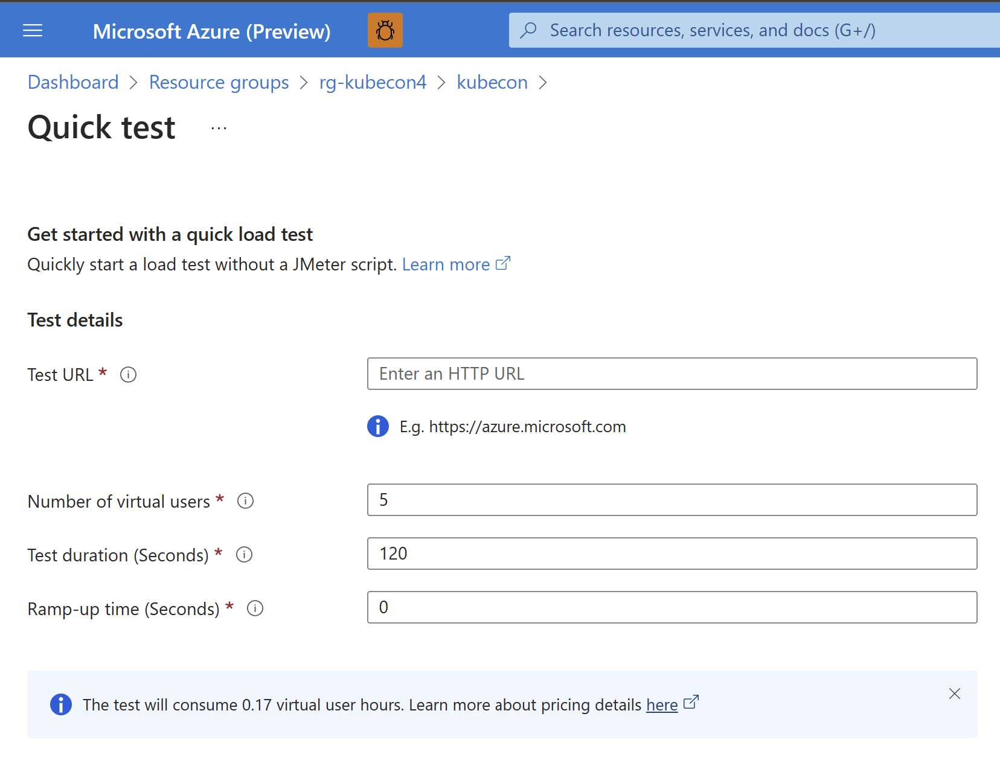
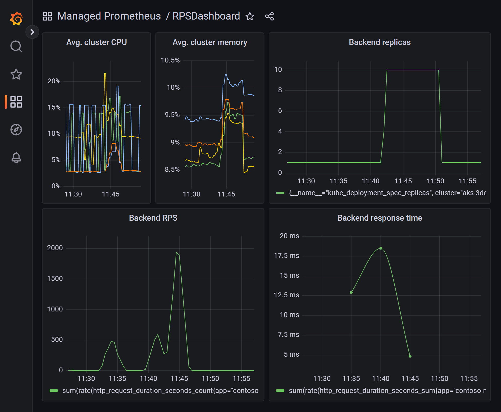

# Demo: Contoso band name generator using the Azure Kubernetes Service (AKS) app base template

## Prerequisites

- [Azure CLI](https://learn.microsoft.com/cli/azure/install-azure-cli)
- [Azure Developer CLI](https://learn.microsoft.com/azure/developer/azure-developer-cli/install-azd). Use the [latest daily build](https://github.com/Azure/azure-dev).
- [Visual Studio Code](https://code.visualstudio.com/download)
- [AKS Developer Extension for Visual Studio Code](https://marketplace.visualstudio.com/items?itemName=ms-kubernetes-tools.aks-devx-tools).

## What is included in this repository

This is the end state repository that was created from the [Azure Kubernetes Service (AKS) app base template](https://github.com/sabbour/aks-app-base-template). To understand more about the Azure Developer CLI architecture and to create a similar template, you can refer to [Make your project compatible with Azure Developer CLI](https://learn.microsoft.com/en-us/azure/developer/azure-developer-cli/make-azd-compatible?pivots=azd-create).

The repository hosts of the following components:

- Azure Developer CLI configuration
- Frontend code and Kubernetes manifests
- Backend code and Kubernetes manifests

### Azure Developer CLI configuration

The template uses Bicep and the [Azure Developer CLI](https://learn.microsoft.com/azure/developer/azure-developer-cli/overview) (`azd`). The [azure.yaml](./azure.yaml) schema defines and describes the apps and types of Azure resources that are included in these templates.

The following infrastructure resources defined as Bicep templates in the `infra` folder are created:
- Azure Kubernetes Service (AKS) cluster
- Azure Container Registry
- Azure Managed Grafana
- Azure Monitor managed service for Prometheus

The template uses the following [event hooks](https://learn.microsoft.com/azure/developer/azure-developer-cli/azd-extensibility) to customize the workflow:

- [preprovision](./infra/azd-hooks/preprovision.sh) to make sure that all the required AKS features are registered.
- [predeploy](./infra/azd-hooks/predeploy.sh) to perform additional configuration that's not possible with Bicep including:
  - Installing the [Azure Service Operator](https://azure.github.io/azure-service-operator/) Helm chart.
  - Installing the [Kubernetes Event Driven Autoscaler (KEDA)](https://keda.sh) Helm chart.
  - Deploying a Grafana dashboard.

### Frontend and backend code and Kubernetes manifests

For more information about the projects and their details, refer to the details outlined in [frontend](./src/frontend/README.md) and [backend](./src/backend/README.md).

## Initializing the template

If you are starting from this end state repo, use `azd init` to clone this template locally.

```
mkdir contoso-names-e2e
cd contoso-names-e2e
azd init -t https://github.com/sabbour/contoso-names-e2e
```

## Deploying infrastructure

Run the pre-provisioning script to ensure your cluster has the required features registered.

```
./infra/azd-hooks/preprovision.sh
```

Deploy the infrastructure by running `azd provision`.

```
azd provision
```

You will be prompted for the following information:

- `Environment Name`: This will be used as a prefix for the resource group that will be created to hold all Azure resources. This name should be unique within your Azure subscription.
- `Azure Subscription`: The Azure Subscription where your resources will be deployed.
- `Azure Location`: The Azure location where your resources will be deployed.

You can monitor the progress in the terminal and on the Azure portal.


After a few minutes, you should see the resources deployed in your subscription.


## Deploying the application

Running `azd deploy` will build the applications defined in [azure.yaml](./azure.yaml) by running a Docker build then the Azure Developer CLI will tag and push the images to the Azure Container Registry. Each deployment creates a new image tag that is used during the token replacement.

```
azd deploy
```

Azure Developer CLI will also apply the Kubernetes manifests in the path configured in [azure.yaml](./azure.yaml). The `name` specified in [azure.yaml](./azure.yaml) will correspond to the Kubernetes namespace that will be created on the cluster where all resources will be deployed to. 

While applying the manifests, the Azure Developer CLI will also perform a token replacement for the placeholders defined in the Kubernetes manifests to insert the container image location, Prometheus endpoint, and more.

The output variables of the Bicep template will also be created as Kubernetes secrets on the cluster.

> Note, it may take a few minutes for everything to be ready. After the Kubernetes manifests are deployed, the Azure Service Operator will start reconciling the resources to create a Resource Group and an Azure Cache for Redis. You may check the progress of the provisioning using `kubectl get redis -n contoso-names`.

## Load testing and monitoring

Once the app is running, you can use a tool, like Azure Load Testing, to generate some load on the backend service and see the scaling in action. The dashboard has already been configured thile while deploying the infrastructure. A KEDA scaler has been configured with a Prometheus trigger that queries the requests per second metric from the Azure Monitor managed Prometheus instance.



You'll need to grant your account `Azure Monitor Data Reader` and `Grafana Admin` roles. You will find the values of `AZURE_MANAGED_PROMETHEUS_RESOURCE_ID` and `AZURE_MANAGED_GRAFANA_RESOURCE_ID` in the `.azure/<environment name>/.env` file.

```
CURRENT_UPN=$(az account show --query user.name -o tsv)
CURRENT_OBJECT_ID=$(az ad user show --id ${CURRENT_UPN} --query id -o tsv)

# Azure Monitor Data Reader role assignment for current user
az role assignment create --assignee "${CURRENT_OBJECT_ID}" \
  --role "b0d8363b-8ddd-447d-831f-62ca05bff136" \
  --scope "${AZURE_MANAGED_PROMETHEUS_RESOURCE_ID}"

# Grafana Admin role assignment for current user
az role assignment create --assignee "${CURRENT_OBJECT_ID}" \
  --role "22926164-76b3-42b3-bc55-97df8dab3e41" \
  --scope "${AZURE_MANAGED_GRAFANA_RESOURCE_ID}"
```

Update the Grafana dashboard file (`infra/monitoring/grafana-dashboard.json`) with your Azure Monitor instance name defined as `AZURE_MANAGED_PROMETHEUS_NAME` in the `.azure/<environment name>/.env` file.
```
sed "s/_AZURE_MANAGED_PROMETHEUS_NAME_/${AZURE_MANAGED_PROMETHEUS_NAME}/g" ./infra/monitoring/grafana-dashboard.json > ./infra/monitoring/grafana-dashboard-updated.json
```

Create the Grafana dashboard from the output file `infra/monitoring/grafana-dashboard-updated.json`. You will find the values of `AZURE_RESOURCE_GROUP` and `AZURE_MANAGED_GRAFANA_NAME` in the `.azure/<environment name>/.env` file.

```
az grafana dashboard create -g ${AZURE_RESOURCE_GROUP} -n ${AZURE_MANAGED_GRAFANA_NAME}  --title "RPSDashboard" --folder managed-prometheus --definition ./infra/monitoring/grafana-dashboard-updated.json
```

You can view this by opening your Azure Managed Grafana dashboard.




## Continuous integration/continuous deployment

There are two GitHub Actions pipelines in this repository, each corresponding to the application to be built and deployed.

The workflows [frontend.yaml](./.github/workflows/frontend.yml) and [backend.yaml](./.github/workflows/backend.yml) use the Azure Developer CLI container image which has the CLI installed to login to the Azure environment with `azd login`, provision the infrastructure with `azd provision`, and deploy the application with `azd deploy <service name>`.

To configure the GitHub repository with the secrets needed to run the pipeline, you'll need to run `azd pipeline config`. 
Since the infrastructure template requires setting up some role assignments, the created service principal will need to have `Owner` permissions on the resource group. 

```
azd pipeline config --principal-role Owner 
```

Once you do so, and if you commit your changes, you should see the pipeline running to build and deploy your application.

## Clean up

To clean up resources that were deployed to your subscription, run `azd down`.