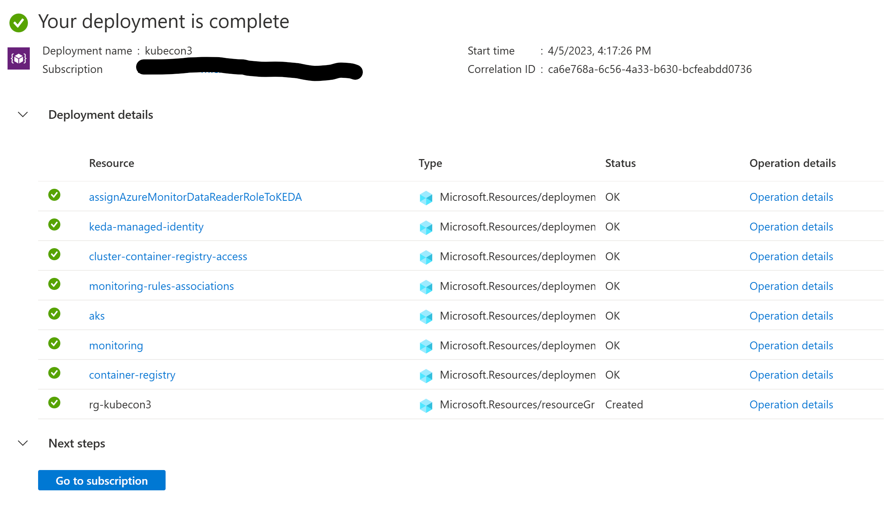
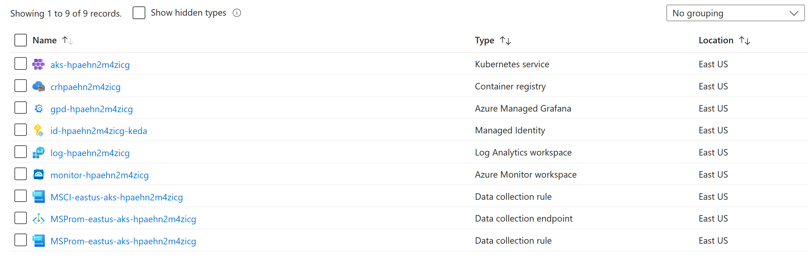

# Demo: Contoso band name generator using the Azure Kubernetes Service (AKS) app base template

## Prerequisites

- [Azure CLI](https://learn.microsoft.com/cli/azure/install-azure-cli)
- [Azure Developer CLI](https://learn.microsoft.com/azure/developer/azure-developer-cli/install-azd). Use the [latest daily build](https://github.com/Azure/azure-dev).
- [Visual Studio Code](https://code.visualstudio.com/download)
- [AKS Developer Extension for Visual Studio Code](https://marketplace.visualstudio.com/items?itemName=ms-kubernetes-tools.aks-devx-tools).

## What is included in this repository

This is the end state repository that was created from the [Azure Kubernetes Service (AKS) app base template](https://github.com/sabbour/aks-app-base-template). To understand more about the Azure Developer CLI architecture and to create a similar template, you can refer to [Make your project compatible with Azure Developer CLI](https://learn.microsoft.com/en-us/azure/developer/azure-developer-cli/make-azd-compatible?pivots=azd-create).

The repository hosts of the following components:

- Azure Developer CLI configuration
- Frontend code and Kubernetes manifests
- Backend code and Kubernetes manifests

### Azure Developer CLI configuration

The template uses Bicep and the [Azure Developer CLI](https://learn.microsoft.com/azure/developer/azure-developer-cli/overview) (`azd`). The [azure.yaml](./azure.yaml) schema defines and describes the apps and types of Azure resources that are included in these templates.

The following infrastructure resources defined as Bicep templates in the `infra` folder are created:
- Azure Kubernetes Service (AKS) cluster
- Azure Container Registry
- Azure Managed Grafana
- Azure Monitor managed service for Prometheus

The template uses the following [event hooks](https://learn.microsoft.com/azure/developer/azure-developer-cli/azd-extensibility) to customize the workflow:

- [preprovision](./infra/azd-hooks/preprovision.sh) to make sure that all the required AKS features are registered.
- [postprovision](./infra/azd-hooks/postprovision.sh) to perform additional configuration that's not possible with Bicep including:
  - Installing the [Azure Service Operator](https://azure.github.io/azure-service-operator/) Helm chart.
  - Installing the [Kubernetes Event Driven Autoscaler (KEDA)](https://keda.sh) Helm chart.
  - Deploying a Grafana dashboard and assigning `Azure Monitor Data Reader` and `Grafana Admin` roles to the current user.

### Frontend and backend code and Kubernetes manifests

For more information about the projects and their details, refer to the details outlined in [frontend](./src/frontend/README.md) and [backend](./src/backend/README.md).

## Initializing the template

If you are starting from this end state repo, use `azd init` to clone this template locally.

```
mkdir contoso-names-e2e
cd contoso-names-e2e
azd init -t https://github.com/sabbour/contoso-names-e2e
```

## Deploying infrastructure

Deploy the infrastructure by running `azd provision`.

You will be prompted for the following information:

- `Environment Name`: This will be used as a prefix for the resource group that will be created to hold all Azure resources. This name should be unique within your Azure subscription.
- `Azure Subscription`: The Azure Subscription where your resources will be deployed.
- `Azure Location`: The Azure location where your resources will be deployed.

You can monitor the progress in the terminal and on the Azure portal.



After a few minutes, you should see the resources deployed in your subscription.



## Deploying the application

Running `azd deploy` will build the applications defined in [azure.yaml](./azure.yaml) by running a Docker build then the Azure Developer CLI will tag and push the images to the Azure Container Registry. Each deployment creates a new image tag that is used during the token replacement.

Azure Developer CLI will also apply the Kubernetes manifests in the path configured in [azure.yaml](./azure.yaml). The `name` specified in [azure.yaml](./azure.yaml) will correspond to the Kubernetes namespace that will be created on the cluster where all resources will be deployed to. 

While applying the manifests, the Azure Developer CLI will also perform a token replacement for the placeholders defined in the Kubernetes manifests to insert the container image location, Prometheus endpoint, and more.

The output variables of the Bicep template will also be created as Kubernetes secrets on the cluster.

## Continuous integration/continuous deployment

## Notable functionality

### Kubernetes Event Driven Autoscaler (KEDA) with Prometheus scaler


### Azure Cache for Redis provisioned using the Azure Service Operator

## Clean up

To clean up resources that were deployed to your subscription, run `azd down`.